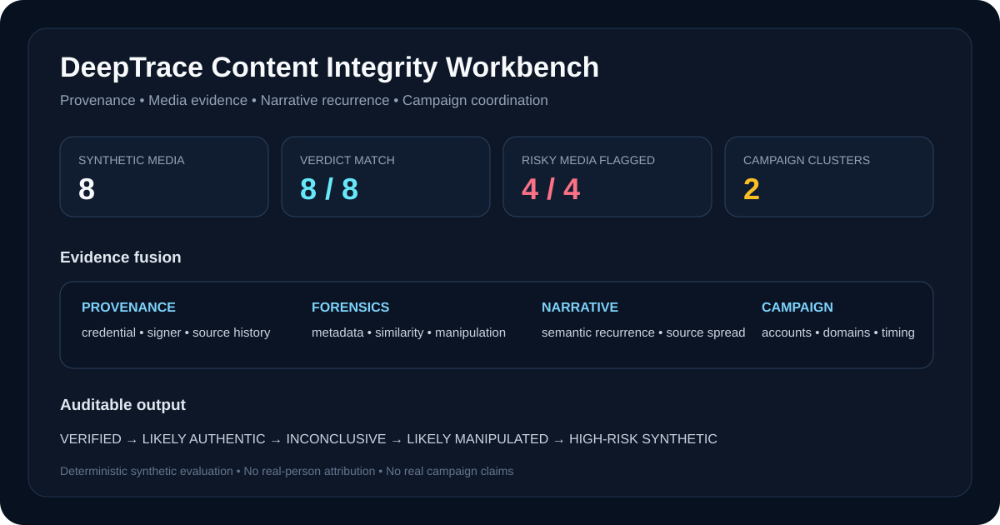
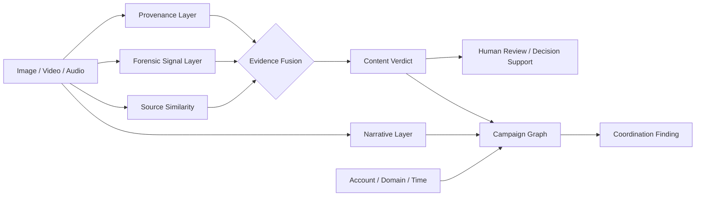
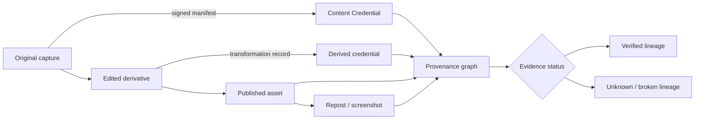
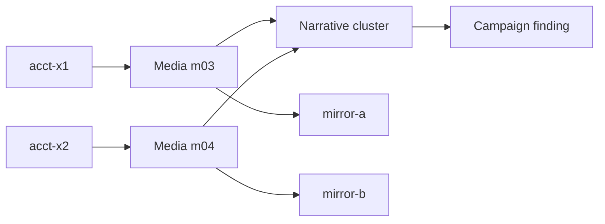

<div align="center">

# DeepTrace

### Content Authenticity, Provenance & Influence-Operation Analysis

**An evidence-fusion workbench for assessing whether digital media is verifiable, likely authentic, inconclusive, manipulated, or high-risk synthetic—and whether related content is spreading as a coordinated campaign.**

[](https://github.com/VinayK88/DeepTrace/actions/workflows/ci.yml)
[](https://www.python.org/)
[](#what-deeptrace-is-used-for)
[](#provenance--c2pa-scope)
[](#security--research-boundary)

**Provenance · media forensics · multimodal evidence · narrative analysis · campaign graphs · calibrated uncertainty**

[Overview](#overview) · [Evidence](#baseline-evidence) · [Architecture](#architecture) · [Provenance](#provenance--c2pa-scope) · [Campaigns](#campaign-analysis) · [API](#api--dashboard) · [Quick Start](#quick-start)

</div>

---



## Overview

DeepTrace is built around a simple principle:

> **Content authenticity should be an evidence problem, not a single “deepfake probability.”**

A media item can be suspicious for very different reasons. It may have no trustworthy provenance, inconsistent metadata, a high synthetic-media signal, strong similarity to a known original that appears altered, or a distribution pattern that suggests coordinated amplification.

DeepTrace keeps those signals separate and then fuses them into an auditable assessment.

```text
Media item
   │
   ├── provenance / signer evidence
   ├── metadata consistency
   ├── known-source similarity
   ├── synthetic-media signal
   ├── manipulation signal
   ├── narrative recurrence
   └── account / domain / timing context
             │
             ▼
       DeepTrace evidence fusion
             │
   ┌─────────┼─────────┬──────────────┐
   ▼         ▼         ▼              ▼
Verified  Authentic  Inconclusive  Manipulated / Synthetic
                                  │
                                  ▼
                        Campaign coordination graph
```

DeepTrace does **not** treat missing provenance as proof that content is fake, and it does **not** treat a forensic score as proof of authorship or intent.

---

## What DeepTrace is used for

<table>
<tr>
<td width="50%" valign="top">

**Content authenticity**

- Provenance-aware media assessment
- Manipulation-signal fusion
- Synthetic-media risk triage
- Known-source / derivative analysis
- Metadata consistency checks

</td>
<td width="50%" valign="top">

**Trust & Safety**

- Content-integrity review queues
- Explainable reviewer evidence
- Uncertainty-aware escalation
- False-positive-conscious decisioning
- Human-review support

</td>
</tr>
<tr>
<td width="50%" valign="top">

**Threat intelligence**

- Narrative clustering
- Cross-account recurrence
- Domain and source relationships
- Temporal amplification analysis
- Campaign-level evidence graphs

</td>
<td width="50%" valign="top">

**National-security research**

- Synthetic influence-operation exercises
- Media provenance analysis
- Coordinated amplification modeling
- Information-environment resilience
- Evidence-based campaign assessment

</td>
</tr>
</table>

Representative users include **content-integrity teams, AI safety teams, trust & safety analysts, threat-intelligence teams, media-forensics researchers, security operations teams, and public-sector information-integrity programs**.

---

## Baseline evidence

The checked-in deterministic fixture contains **8 synthetic multimodal evidence envelopes** spanning image, video, and audio scenarios.

| Measure | Current baseline |
| --- | ---: |
| Synthetic media items | **8** |
| Expected verdicts matched | **8 / 8** |
| Intentionally risky media flagged | **4 / 4** |
| Verified items | **2** |
| Likely manipulated | **2** |
| High-risk synthetic | **2** |
| Likely authentic | **1** |
| Inconclusive | **1** |
| Coordinated narrative clusters detected | **2** |
| Unit tests | **6 / 6 passing locally** |

### Current decision set

| Content | Evidence pattern | Verdict |
| --- | --- | --- |
| `m01` | Valid synthetic provenance + trusted signer + consistent metadata + source match | `VERIFIED` |
| `m02` | Valid synthetic provenance + trusted signer + consistent metadata + source match | `VERIFIED` |
| `m03` | No provenance + metadata mismatch + strong source similarity + high manipulation signal | `LIKELY_MANIPULATED` |
| `m04` | Similar derivative/manipulation pattern | `LIKELY_MANIPULATED` |
| `m05` | Weak source match + high synthetic-audio signal | `HIGH_RISK_SYNTHETIC` |
| `m06` | High synthetic-video signal + weak source match | `HIGH_RISK_SYNTHETIC` |
| `m07` | Consistent metadata + moderate source similarity + low risk signals | `LIKELY_AUTHENTIC` |
| `m08` | Mixed evidence with no dominant signal | `INCONCLUSIVE` |

> The baseline is intentionally small and synthetic. It demonstrates **decision behavior and evidence accounting**, not real-world detector accuracy.

The reproducible report is checked in at [`reports/baseline.json`](reports/baseline.json).

---

## Architecture



### Evidence layers

| Layer | Question |
| --- | --- |
| **Provenance** | Is there a verifiable content history and trusted signer? |
| **Metadata** | Are the recorded media attributes internally consistent? |
| **Source similarity** | Does the asset strongly resemble a known source or derivative? |
| **Synthetic signal** | Do model/forensic features indicate generated media? |
| **Manipulation signal** | Do features indicate modification of an existing asset? |
| **Narrative** | Which semantic claim is the media carrying? |
| **Coordination** | Are multiple accounts/domains amplifying related content in a concentrated time window? |

---

## Verdict model

DeepTrace uses five outputs instead of a binary `REAL / FAKE` label:

```text
VERIFIED
   │ strong provenance + trusted signer + supporting evidence
   ▼
LIKELY_AUTHENTIC
   │ supporting evidence, but no cryptographic verification
   ▼
INCONCLUSIVE
   │ mixed or insufficient evidence
   ▼
LIKELY_MANIPULATED
   │ strong derivative / manipulation evidence
   ▼
HIGH_RISK_SYNTHETIC
     strong synthetic-generation evidence
```

The distinction matters because **absence of Content Credentials is not evidence of fabrication**, and a synthetic-media detector should not be treated as an attribution engine.

### Example assessment

```text
DEEPTRACE CONTENT ASSESSMENT

Content            m03
Media              image
Source             social-upload

Provenance         unavailable
Signer trust       unavailable
Metadata           inconsistent
Known-source match 0.91
Synthetic signal   0.34
Manipulation       0.82

Verdict            LIKELY_MANIPULATED
Confidence         0.885
Risk score         61 / 100

Evidence
- strong similarity to a known-source asset
- high manipulation signal

Cautions
- no verifiable provenance credential
- metadata consistency check failed
```

The report keeps **evidence** and **cautions** separate so reviewers can see why the decision was reached.

---

## Provenance & C2PA scope

DeepTrace is **C2PA-aware**, but the current portfolio implementation does not pretend to be a cryptographic C2PA validator.

The synthetic fixture models:

```text
credential present?
        │
        ├── validation outcome
        ├── signer trust
        ├── metadata consistency
        └── source / transformation evidence
```

The design is aligned conceptually with Content Credentials: provenance should describe the **source and history of media**, while trust decisions still depend on signer identity and other evidence.

C2PA 2.4, released in April 2026, includes the Content Credentials technical specification and newer provenance capabilities. A production DeepTrace implementation would integrate a real C2PA validator rather than accepting fixture booleans.

### Production provenance graph



---

## Campaign analysis

DeepTrace does not stop at the media item.

A manipulated asset may matter because of **how it propagates**.

The synthetic campaign layer groups repeated narratives and scores coordination from:

- number of distinct accounts;
- temporal concentration;
- repeated high-risk media carrying the same narrative;
- shared or related domains.

### Example influence pattern

```text
Manipulated image m03 ── acct-x1 ── mirror-a.example
          │
          ├──────────── narrative: "secret attack"
          │
Manipulated image m04 ── acct-x2 ── mirror-b.example

                 4-minute window
                       │
                       ▼
             COORDINATION FINDING
```

A separate synthetic cluster contains high-risk audio/video carrying a repeated narrative across two accounts and multiple domains.

### Campaign graph



**Important:** coordination evidence is not actor attribution. DeepTrace deliberately keeps *“these items appear coordinated”* separate from *“who is responsible and why.”*

---

## Confidence & uncertainty

DeepTrace treats uncertainty as a first-class output.

A confidence value means **strength of the evidence supporting this lab's verdict**, not:

- probability that a named person created the content;
- probability that a specific state or group is responsible;
- proof of malicious intent;
- legal proof that an asset is false.

This is why `INCONCLUSIVE` is a valid result rather than forcing every media item into a binary decision.

---

## API & dashboard

DeepTrace includes a FastAPI service and a dark content-integrity dashboard.

```bash
pip install -e '.[api]'
uvicorn deeptrace.api:app --reload
```

Open:

```text
http://127.0.0.1:8000
```

Endpoints:

```text
GET  /healthz
GET  /report
POST /assess
GET  /docs
```

The dashboard surfaces:

- content verdict distribution;
- confidence and risk scores;
- risky-media capture;
- campaign findings;
- narrative clusters;
- evidence used in each assessment.

### Assessment API example

```json
{
  "content_id": "sample-001",
  "media_type": "image",
  "source": "publisher",
  "c2pa_present": true,
  "c2pa_valid": true,
  "signer_trusted": true,
  "metadata_consistent": true,
  "known_source_similarity": 0.96,
  "synthetic_signal": 0.05,
  "manipulation_signal": 0.04,
  "narrative": "example claim",
  "account_id": "acct-example",
  "domain": "publisher.example",
  "minute": 10,
  "expected_verdict": "VERIFIED"
}
```

The API returns a verdict, confidence, risk score, supporting evidence, and cautions.

---

## Engineering & quality

| Area | Implementation |
| --- | --- |
| Evidence model | Typed Python dataclasses |
| Content assessment | Deterministic evidence-fusion engine |
| Media coverage | Synthetic image, video, and audio envelopes |
| Provenance | C2PA-aware synthetic validation fields |
| Campaign analysis | Narrative + account + domain + temporal coordination |
| Explainability | Evidence and caution lists per verdict |
| Interface | CLI + FastAPI dashboard/API |
| Reproducibility | Checked-in deterministic baseline |
| Deployment | Dockerfile |
| Quality | Unit tests + Python 3.10–3.12 GitHub Actions |

---

## Quick start

```bash
git clone https://github.com/VinayK88/DeepTrace.git
cd DeepTrace

python -m venv .venv
source .venv/bin/activate
pip install -e '.[api]'

# Generate deterministic assessment + campaign report
deeptrace

# Run tests
python -m unittest discover -s tests -v

# Start dashboard/API
uvicorn deeptrace.api:app --reload
```

Docker:

```bash
docker build -t deeptrace .
docker run --rm -p 8000:8000 deeptrace
```

---

## Repository map

```text
DeepTrace/
├── deeptrace/
│   ├── engine.py       # content assessment + campaign detection
│   ├── fixtures.py     # synthetic multimodal evidence
│   ├── models.py       # typed evidence / assessment objects
│   ├── report.py       # reproducible baseline report
│   ├── api.py          # FastAPI dashboard + assessment API
│   └── cli.py          # command-line report generator
├── assets/
│   └── deeptrace-overview.svg
├── docs/
│   └── methodology.md
├── reports/
│   └── baseline.json
├── tests/
├── .github/workflows/
│   └── ci.yml
├── Dockerfile
├── SECURITY.md
└── README.md
```

---

## Production evolution

A real content-integrity platform would extend this lab with:

- cryptographic C2PA / Content Credentials validation;
- actual image, video, and audio forensic models;
- perceptual hashing and robust media fingerprinting;
- embedding-based cross-modal similarity;
- calibrated model ensembles with uncertainty estimates;
- source reputation and provenance-chain validation;
- privacy-preserving account and propagation analytics;
- streaming narrative clustering;
- graph-based campaign investigation;
- analyst review and disposition feedback loops;
- benchmark datasets with demographic and domain-slice evaluation;
- adversarial robustness testing against recompression, cropping, transcoding, screenshots, and laundering;
- tamper-evident case evidence and audit logs.

The most important production principle is that **provenance, forensic detection, and campaign coordination remain independent evidence classes** rather than being collapsed into one opaque score.

---

## Security & research boundary

**Everything in the current repository is synthetic and defensive.**

DeepTrace does not scrape real social-media accounts, identify real individuals, attribute real influence operations, generate deceptive media, or claim production deepfake-detection accuracy.

The C2PA fields are synthetic validation outcomes; cryptographic manifest verification is a production roadmap item. The media signals are deterministic fixture values rather than outputs from production computer-vision or audio models.

See [`SECURITY.md`](SECURITY.md) and [`docs/methodology.md`](docs/methodology.md).

---

<div align="center">

### Authenticity is an evidence chain, not a single score.

**Content Provenance · Multimodal Integrity · Influence Analysis · Calibrated Uncertainty**

</div>
