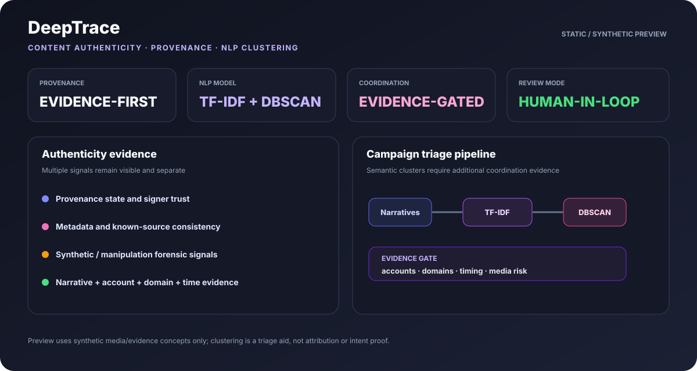
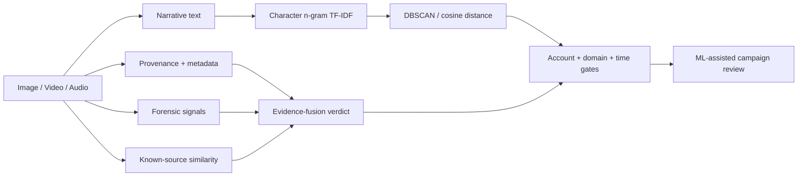

<div align="center">

# DeepTrace

### Content Authenticity · Provenance · NLP Campaign Clustering

**A defensive content-integrity workbench that combines provenance-aware evidence fusion with unsupervised NLP clustering for coordinated narrative triage.**

[](https://github.com/VinayK88/DeepTrace/actions/workflows/ci.yml)
[](https://www.python.org/)
[](#ml-campaign-clustering)
[](#evaluation-boundary)

**Provenance · media forensics · TF-IDF · DBSCAN · semantic similarity · campaign graphs · Trust & Safety**

</div>

---




## Overview

DeepTrace is built around two separate questions:

> **What evidence supports the authenticity or manipulation assessment of this media item?**

> **Are semantically related risky items being amplified across multiple accounts or domains in a concentrated time window?**

The first question remains deterministic and provenance-aware. The second now has an **unsupervised ML layer**.



DeepTrace does **not** collapse provenance, deepfake signals, and campaign behavior into one opaque probability.

## Synthetic baseline

The fixture contains 8 synthetic multimodal evidence envelopes across image, video, and audio scenarios.

| Measure | Baseline |
| --- | ---: |
| Media items | **8** |
| Expected verdicts matched | **8 / 8** |
| Intentionally risky media flagged | **4 / 4** |
| Verified | **2** |
| Likely manipulated | **2** |
| High-risk synthetic | **2** |
| Likely authentic | **1** |
| Inconclusive | **1** |
| Deterministic campaign findings | **2** |

These values are synthetic implementation evidence, not real-world detector accuracy.

## ML campaign clustering

DeepTrace now uses:

```text
Narrative text
    ↓
character 3–5 gram TF-IDF
    ↓
cosine-distance DBSCAN
    ↓
semantic clusters
    ↓
account + domain + temporal + media-risk gates
    ↓
ML campaign finding
```

### Why DBSCAN?

DBSCAN is useful here because the number of possible campaigns is not known in advance and isolated narratives can remain unclustered. DeepTrace uses cosine distance over TF-IDF narrative vectors.

### Why character n-grams?

The public lab avoids downloading a large embedding model or calling an external API. Character n-grams still provide a reproducible semantic-similarity proxy that tolerates small wording differences and keeps CI lightweight.

### Evidence gates

A semantic cluster is **not automatically labeled coordinated**. The current defensive gate requires:

- at least two distinct accounts;
- at least two items with strong synthetic/manipulation evidence;
- sufficient combined semantic similarity, temporal concentration, account/domain diversity, and risk evidence.

This prevents a legitimate repeated news narrative from being escalated merely because multiple publishers discuss the same event.

Detailed methodology: [`docs/ml-campaign-clustering.md`](docs/ml-campaign-clustering.md).

## Content verdict model

DeepTrace preserves five evidence-aware outputs:

```text
VERIFIED
LIKELY_AUTHENTIC
INCONCLUSIVE
LIKELY_MANIPULATED
HIGH_RISK_SYNTHETIC
```

Signals include:

- synthetic C2PA/provenance state and signer trust;
- metadata consistency;
- known-source similarity;
- synthetic-media signal;
- manipulation signal.

Missing provenance alone is **not** treated as proof that content is fake.

## Example ML finding

```json
{
  "cluster_id": "ml-camp-01",
  "content_ids": ["m03", "m04"],
  "accounts": ["acct-x1", "acct-x2"],
  "domains": ["mirror-a.example", "mirror-b.example"],
  "semantic_similarity": 1.0,
  "risky_items": 2,
  "coordination_score": 0.0
}
```

The exact executable coordination score is generated at runtime; the example is schematic rather than a claimed production metric.

## Report output

`deeptrace` now returns both deterministic and ML campaign evidence:

```text
summary
assessments
campaigns            # deterministic narrative grouping
automated ML metadata
ml_campaigns         # TF-IDF + DBSCAN clusters passing evidence gates
```

This lets reviewers compare a transparent rule-based approach with an unsupervised clustering approach on the same synthetic fixture.

## API & dashboard

```bash
pip install -e '.[api]'
uvicorn deeptrace.api:app --reload
```

Endpoints include:

```text
GET  /healthz
GET  /report
POST /assess
GET  /docs
```

## Quick start

```bash
git clone https://github.com/VinayK88/DeepTrace.git
cd DeepTrace
python -m venv .venv
source .venv/bin/activate
pip install -e '.[api]'
deeptrace
python -m unittest discover -s tests -v
uvicorn deeptrace.api:app --reload
```

Docker:

```bash
docker build -t deeptrace .
docker run --rm -p 8000:8000 deeptrace
```

## Why this ML is different from BrowserGuard / AgentAtlas

```text
BrowserGuard → behavioral anomaly detection with Isolation Forest
AgentAtlas   → identity/posture anomaly detection + peer deviation
DeepTrace    → NLP vectorization + density-based campaign clustering
```

DeepTrace therefore adds **NLP and unsupervised clustering** to the portfolio rather than repeating another risk-score model.

## Evaluation boundary

All media, narratives, domains, accounts, provenance states, and forensic signals are synthetic. The clustering tests verify reproducibility and intended grouping on the fixture. They do not establish production campaign-detection precision/recall, actor attribution, intent, or state sponsorship.

A production evolution would use authorized content streams, multilingual transformer embeddings, multimodal similarity, temporal graph features, calibrated review thresholds, drift monitoring, analyst feedback, and real cryptographic provenance validation.
